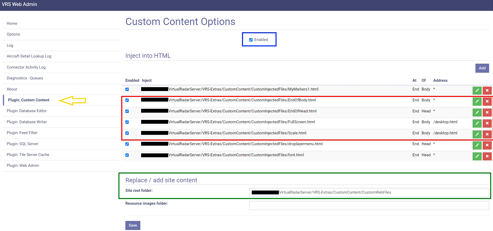
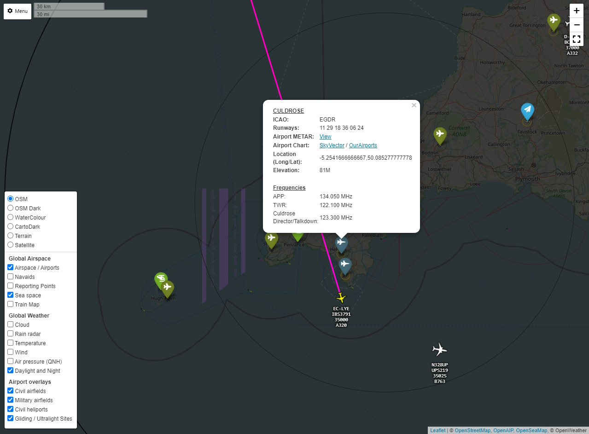

# Overlays and map controls for Virtual Radar Server (VRS) using Leaflet maps.

This JavaScript code is a plugin for the ADSB aircraft tracking [Virtual Radar Server](http://www.virtualradarserver.co.uk) software. The Javascript files need to be used with the Virtual Radar Server [Custom Content plugin](http://www.virtualradarserver.co.uk/Documentation/CustomContent/Default.aspx).

This repo brings together and updates several scripts (`EndOfHead.html` and `EndOfBody.html`) written by others as well as adds new scripts (`Scale.html` and `Fullscreen.html`)  

&nbsp; 

#### `EndOfHead.html` and `EndOfBody.html`

These two files work in tandem to insert a icon with pop up at the bottom left of the map and allows the user to select airspace layers, weather layers and UK specific overlays which will be added to the base Leaflet map used in VRS.

Users will need to sign up for API keys for some of the functionalty of this script to work properly.
1) [Open Weather 1.0 API key](https://openweathermap.org/api/weathermaps) Please note: if you do not enter an API key the Pressure, Temperature and Wind layer will no show in the menu.
2) [OpenAIP Key](https://www.openaip.net/) Please note: if you do not enter an API key the Airspace layer will not show on the map.
3) [Thunderforest](https://www.thunderforest.com/) Please note: if you do not enter an API key the [Spinal Map](https://www.thunderforest.com/maps/spinal-map/) will not display.

This script is set up to work with VRS as a baremetal install and also to work with [SDR-Enthusiasts](https://github.com/sdr-enthusiasts) docker container for [VRS](https://github.com/sdr-enthusiasts/docker-virtualradarserver). For those working with a baremetal install of VRS the keys need to be inserted into the script here: (around line 50 ish) (Skip this if using the docker container VRS as these are all part of the compose for the container)

````
 // Add API Keys here
 var OPENWXAPIKEY     = `##OPENWXAPIKEY##`;     // replace ##OPENWXAPIKEY## with your key and KEEP the ` `
 var OPENAIPKEY       = `##OPENAIPKEY##`;       // replace ##OPENAIPKEY##  with your key and KEEP the ` `
 var THUNDERFORESTKEY = `##THUNDERFORESTKEY##`; // replace ##THUNDERFORESTKEY##  with your key and KEEP the ` `
````

The user can set default options from within the script to allow a specific map and your choice of layers to be enabled by default. Just set the map number to which ever one you want, and for the layers change those that you want on start up from a 0 to a 1. These options can be found near the top of the script.

````
                    // Configuration
                    var config =
                    {
                        /* Map Config */
                        defaultMap: 1,                      // 1: OpenStreetMap, 2: OpenStreetMap Dark, 3: OpenTopoMap, 4: WaterColour, 5: CartoDark, 6: Terrain, 7: Satellite, 8: Spinal Map
                        layerMenuPosition: `bottomleft`,    // Valid positions: `topleft`, `topright`, `bottomleft` or `bottomright`

                        /* Enable Layers */
                        airspace: 1,
                        navAids: 0,
                        tfrUSA: 0,
                        seaMarkers: 1,
                        trainMap: 0,
                        clouds: 0,
                        rain: 1,
                        temps: 0,
                        wind: 0,
                        pressure: 0,
                        dayNight: 1,
                        civilAirfields: 0,
                        militaryAirfields: 0,
                        heliports: 0,
                        glidingSpots: 0
                    };
````

The above options are set to show the OpenStreetMap and show the OpenAIP Airspace layer, the OpenSea layer, the Rainviewer layer and the day/night terminator as default.  

&nbsp; 

#### `Fullscreen.html`

Adds a full screen button to the VRS map under the zoom +/- buttons and moves the +/- buttons to the top right of the screen.

&nbsp; 

#### `Scale.html`

Adds a distance scale next to the VRS menu in the top left of the map

&nbsp; 

## Installation

Ensure Custom Content Plugin installed (Yellow Arrow). Enable Custom content plugin (Blue box) Put the HTML files in the required folder for the Custom Content plugin as per Custom Content plugin [instructions](https://www.virtualradarserver.co.uk/Documentation/CustomContent/Default.aspx) (Red Box) and the entire __contents of__ `Put these files in VRS root folder` folder into the root folder referenced by the Custom Content plugin (Green Box) and then set up the files injections as per the bottom 4 lines in the below image (Red Box again):



### Localisation

Defaults to GB airports etc. If you wish to change to airports for your country remove the country code  e.g. `DE` from the end of the .geojson files in the `Put these files in VRS root folder` before placing them in the root folder for your VRS

`airportsDE.geojson` --> `airports.geojson`

Countries added on request - please open an issue to request

##### IMPORTANT NOTICE: These overlays contain aviation airscape, weather, navigational aids, airfield information, etc. All of these are purely for entertainment / hobby use and MUST NEVER be relied upon to any extent for real world aviation / flying. You should always use the latest legal airspace charts and weather information as published by official sources. This is not an official source. By using this code you agree to make users of your webpage aware of this, and agree that the publisher is not responsible for any loss or damage resulting from the use of this code. The airspace charts, navigational aids,aerodrome information, weather, etc will not be 100% complete or accurate and will contain errors.

##### THE SOFTWARE IS PROVIDED "AS IS", WITHOUT WARRANTY OF ANY KIND, EXPRESS OR IMPLIED, INCLUDING BUT NOT LIMITED TO THE WARRANTIES OF MERCHANTABILITY, FITNESS FOR A PARTICULAR PURPOSE AND NONINFRINGEMENT. IN NO EVENT SHALL THE AUTHORS OR COPYRIGHT HOLDERS BE LIABLE FOR ANY CLAIM, DAMAGES OR OTHER LIABILITY, WHETHER IN AN ACTION OF CONTRACT, TORT OR OTHERWISE, ARISING FROM, OUT OF OR IN CONNECTION WITH THE SOFTWARE OR THE USE OR OTHER DEALINGS IN THE SOFTWARE.

I am very grateful for the following resources which have been used in this code:

- Airspace overlay data courtesy of [Open AIP](http://www.openaip.net)
- Weather overlay images courtesy of [Open Weather](https://openweathermap.org) and [RainViewer](https://www.rainviewer.com/)
- Original script work for EndOfHead and EndOfBody from [Charlie Golf Aviation](https://www.youtube.com/channel/UCcy9zUttQEi-yRMEXTtBpRg)
- Waypoint markers from [sam210723](https://github.com/sam210723/vrs-waypoints)
- Leaflet grouped layer control from [ismyrnow](https://github.com/ismyrnow/leaflet-groupedlayercontrol)
- Night and day overlay from [Jörg Dietrich](http://joergdietrich.github.io/Leaflet.Terminator/)
- Baselayer colour filters from [xtk93x](https://github.com/xtk93x/Leaflet.TileLayer.ColorFilter.git)
- Leaflet awesome markers from [Ivoogdt](https://github.com/lvoogdt/Leaflet.awesome-markers)
- forked/copied from [M7SPI/vrs-overlays](https://github.com/M7SPI/vrs-overlays)
- [johnex](https://github.com/Johnex) for tidying the code and proper implimentation of the rainviewer layers
- [dziban](https://github.com/dziban303) for US TFR

Screenshot of working example:



Also can be seen working on my VRS page - [cornwallvrs.duckdns.org/vrs](https://www.cornwallvrs.duckdns.org/vrs).
